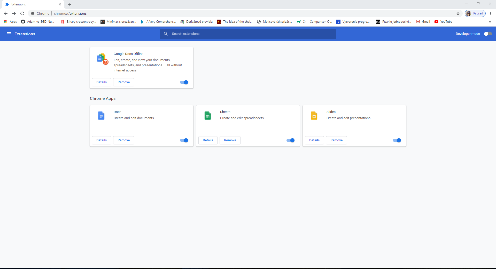
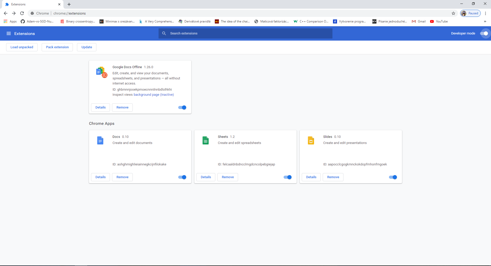
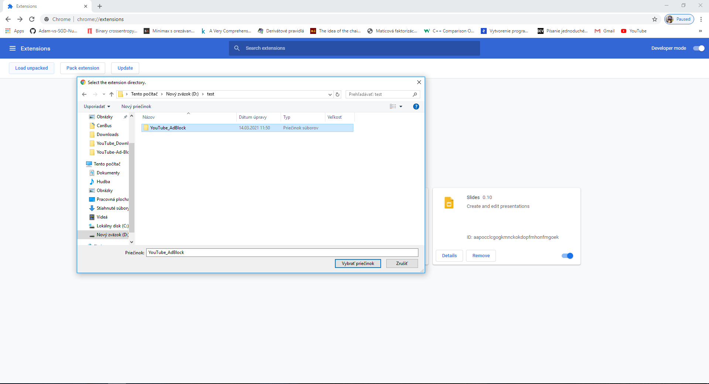

# YouTube AdBlock

## Install extension locally

### Download and unzip
https://github.com/MartinMatta/YouTube_AdBlock/archive/refs/heads/main.zip

Open chrome://extensions/

### Step 1
Click on Extensions

  

### Step 2
Enable Developer mode

  

### Step 3
Click on Load Unpacked

  

